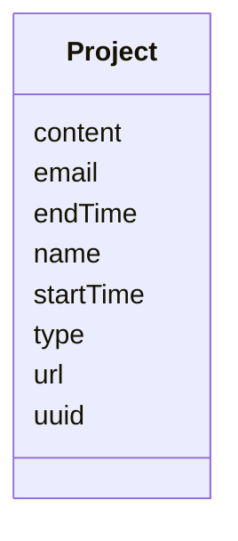

# Class: Project


URI: [https://bengo.is/ns/activity/:Project](https://bengo.is/ns/activity/:Project)





<!-- no inheritance hierarchy -->


## Slots

| Name | Cardinality and Range | Description | Inheritance |
| ---  | --- | --- | --- |
| [uuid](uuid.md) | 1..1 <br/> NONE | uuid | direct |
| [type](type.md) | 0..* <br/> NONE |  | direct |
| [name](name.md) | 1..1 <br/> NONE | a human-readable name of the object | direct |
| [url](url.md) | 1..1 <br/> NONE |  | direct |
| [content](content.md) | 0..1 <br/> NONE |  | direct |
| [startTime](startTime.md) | 0..1 <br/> [xsd:dateTime](http://www.w3.org/2001/XMLSchema#dateTime) |  | direct |
| [endTime](endTime.md) | 0..1 <br/> [xsd:dateTime](http://www.w3.org/2001/XMLSchema#dateTime) |  | direct |
| [email](email.md) | 0..1 <br/> NONE |  | direct |


## Usages

| used by | used in | type | used |
| ---  | --- | --- | --- |
| [Roadmap](Roadmap.md) | [projects](projects.md) | range | [Project](Project.md) |


## Identifier and Mapping Information


### Schema Source


* from schema: https://bengo.is/ns/activity


## Mappings

| Mapping Type | Mapped Value |
| ---  | ---  |
| self | https://bengo.is/ns/activity/:Project |
| native | https://bengo.is/ns/activity/:Project |


## LinkML Source

<!-- TODO: investigate https://stackoverflow.com/questions/37606292/how-to-create-tabbed-code-blocks-in-mkdocs-or-sphinx -->

### Direct

<details>
```yaml
name: Project
from_schema: https://bengo.is/ns/activity
rank: 1000
slots:
- uuid
- type
attributes:
  name:
    name: name
    description: a human-readable name of the object
    from_schema: https://bengo.is/ns/activity
    rank: 1000
    slot_uri: activitystreams:name
    required: true
  url:
    name: url
    from_schema: https://bengo.is/ns/activity
    rank: 1000
    slot_uri: activitystreams:url
    identifier: true
    required: true
  content:
    name: content
    from_schema: https://bengo.is/ns/activity
    rank: 1000
    slot_uri: activitystreams:content
  startTime:
    name: startTime
    from_schema: https://bengo.is/ns/activity
    rank: 1000
    slot_uri: activitystreams:startTime
    range: datetime
  endTime:
    name: endTime
    from_schema: https://bengo.is/ns/activity
    rank: 1000
    slot_uri: activitystreams:endTime
    range: datetime
  email:
    name: email
    from_schema: https://bengo.is/ns/activity
    rank: 1000

```
</details>

### Induced

<details>
```yaml
name: Project
from_schema: https://bengo.is/ns/activity
rank: 1000
attributes:
  name:
    name: name
    description: a human-readable name of the object
    from_schema: https://bengo.is/ns/activity
    rank: 1000
    slot_uri: activitystreams:name
    alias: name
    owner: Project
    domain_of:
    - Project
    range: string
    required: true
  url:
    name: url
    from_schema: https://bengo.is/ns/activity
    rank: 1000
    slot_uri: activitystreams:url
    identifier: true
    alias: url
    owner: Project
    domain_of:
    - Project
    range: string
    required: true
  content:
    name: content
    from_schema: https://bengo.is/ns/activity
    rank: 1000
    slot_uri: activitystreams:content
    alias: content
    owner: Project
    domain_of:
    - Project
    range: string
  startTime:
    name: startTime
    from_schema: https://bengo.is/ns/activity
    rank: 1000
    slot_uri: activitystreams:startTime
    alias: startTime
    owner: Project
    domain_of:
    - Project
    range: datetime
  endTime:
    name: endTime
    from_schema: https://bengo.is/ns/activity
    rank: 1000
    slot_uri: activitystreams:endTime
    alias: endTime
    owner: Project
    domain_of:
    - Project
    range: datetime
  email:
    name: email
    from_schema: https://bengo.is/ns/activity
    rank: 1000
    alias: email
    owner: Project
    domain_of:
    - Project
    range: string
  uuid:
    name: uuid
    description: uuid
    from_schema: https://bengo.is/ns/activity
    rank: 1000
    alias: uuid
    owner: Project
    domain_of:
    - Project
    - Roadmap
    range: string
    required: true
  type:
    name: type
    from_schema: https://bengo.is/ns/activity
    rank: 1000
    slot_uri: activitystreams:type
    multivalued: true
    alias: type
    owner: Project
    domain_of:
    - Project
    - Roadmap
    range: string

```
</details>