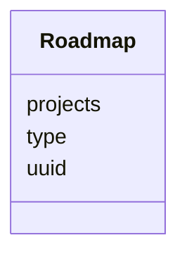

# Class: Roadmap


URI: [https://bengo.is/ns/activity/:Roadmap](https://bengo.is/ns/activity/:Roadmap)





<!-- no inheritance hierarchy -->


## Slots

| Name | Cardinality and Range | Description | Inheritance |
| ---  | --- | --- | --- |
| [uuid](uuid.md) | 1..1 <br/> NONE | uuid | direct |
| [type](type.md) | 0..* <br/> NONE |  | direct |
| [projects](projects.md) | 0..* <br/> [Project](Project.md) |  | direct |


## Identifier and Mapping Information


### Schema Source


* from schema: https://bengo.is/ns/activity


## Mappings

| Mapping Type | Mapped Value |
| ---  | ---  |
| self | https://bengo.is/ns/activity/:Roadmap |
| native | https://bengo.is/ns/activity/:Roadmap |


## LinkML Source

<!-- TODO: investigate https://stackoverflow.com/questions/37606292/how-to-create-tabbed-code-blocks-in-mkdocs-or-sphinx -->

### Direct

<details>
```yaml
name: Roadmap
from_schema: https://bengo.is/ns/activity
rank: 1000
slots:
- uuid
- type
attributes:
  projects:
    name: projects
    from_schema: https://bengo.is/ns/activity
    rank: 1000
    multivalued: true
    range: Project
    inlined: true
    inlined_as_list: true
tree_root: true

```
</details>

### Induced

<details>
```yaml
name: Roadmap
from_schema: https://bengo.is/ns/activity
rank: 1000
attributes:
  projects:
    name: projects
    from_schema: https://bengo.is/ns/activity
    rank: 1000
    multivalued: true
    alias: projects
    owner: Roadmap
    domain_of:
    - Roadmap
    range: Project
    inlined: true
    inlined_as_list: true
  uuid:
    name: uuid
    description: uuid
    from_schema: https://bengo.is/ns/activity
    rank: 1000
    alias: uuid
    owner: Roadmap
    domain_of:
    - Project
    - Roadmap
    range: string
    required: true
  type:
    name: type
    from_schema: https://bengo.is/ns/activity
    rank: 1000
    slot_uri: activitystreams:type
    multivalued: true
    alias: type
    owner: Roadmap
    domain_of:
    - Project
    - Roadmap
    range: string
tree_root: true

```
</details>