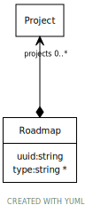

# Class: Roadmap

URI: [https://bengo.is/ns/planning/Roadmap](https://bengo.is/ns/planning/Roadmap)

## Attributes

### Own

 * [uuid](uuid.md)  1..1
     * Description: uuid
     * Range: [String](types/String.md)
 * [type](type.md)  0..\*
     * Range: [String](types/String.md)
 * [➞projects](roadmap__projects.md)  0..\*
     * Range: [Project](Project.md)
